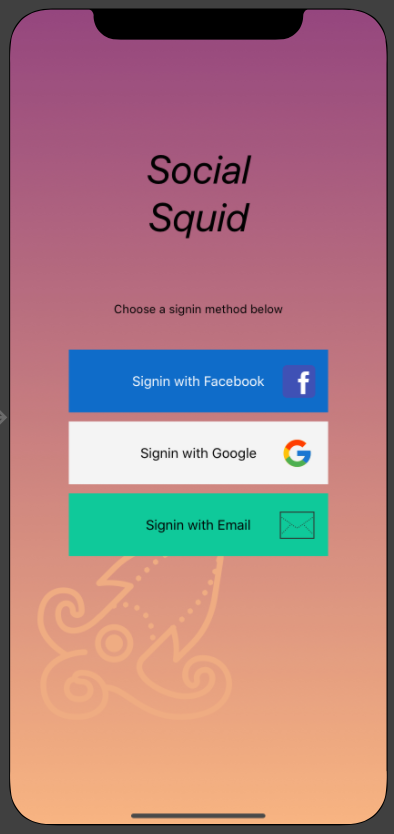

Boy howdy, what a month! For March, Logan and I decided to learn about making native iOS applications in the [`Swift`](https://developer.apple.com/swift/) programming language. Why? Well, we've always wanted to build some app / website / something cool together, and Logan often comes up with cool app ideas for iOS (yeah, he's an Apple guy). So, time to make a mobile app!

> Now one of the biggest questions: _Which language / framework to use_?

If you've done any research on this subject, you'll know there's many languages and even multiple platforms / operating systems for mobile phones! To name a few...

-   To make native Apple (iOS) phone apps, you could use:
    -   Swift
    -   Objective C
-   To make Android phone apps:
    -   Java
-   To make Windows phone apps:
    -   Well... Don't. There aren't many Windows phones around these days :D

Are these the only options? For a while, yes. So if your company wanted to create an app that would work on iOS **and** Android, you'd have to hire 2 specialized developers (or pay 1 dev who knows everything lots of money)! Now'days, there are many cross-platform languages / frameworks that help 1 developer create apps for both types of devices. These cross-platform frameworks are not "perfect" (a.k.a. you still often have to write at least a little bit of native code for each device), but overall these options work quite well on both devices:

-   C# (language) with Xamarin (framework)
-   Dart (language) with Flutter (framework)
-   Javascript (language) with React Native (framework)
-   Javascript (language) with Ionic + Angular or React (framework)

Personally, I have experience with option 3 - Javascript (language) with React Native (framework). However, it would be kinda boring for me to wait for Logan to take some tutorials by himself, catching up on Javascript and React Native, so we decided it could be more fun to learn something from scratch - together!

So it became... `Swift`! 👍

## Let's get going

So how did we get started learning this new language? My idea was to try to find a nice channel where a certain person has made many tutorials for iOS development. Luckily, it was quite easy to find a guy named Chris who has a fantastic Youtube channel [CodeWithChris](https://www.youtube.com/channel/UC2D6eRvCeMtcF5OGHf1-trw), where he has posted **many, many** iOS app tutorials. Woohoo!!

The video I started with was [iOS Tutorial (2020): How To Make Your First App](https://youtu.be/09TeUXjzpKs). This seemed quite reasonable since I know programming languages change year to year, and this tutorial was ready for 2020! (Even though it was published April 17, 2019... fishy? haha)

Now... to be honest, I'm not sure what kind of details are useful to write about our experiences with our first tutorial(s)... So here's a list of notes **I** found interesting about the Swift programming language & the application `Xcode`, which makes Swift + iOS development much smoother. Hope this is interesting to any other human being :D

## Lesson 1: "Hello World" App in Xcode

-   If you want to edit your UI using `main.storyboard`, you have to make sure to select a `User Interface` of `Storyboard` while creating your project. The default is `SwiftUI`, fyi.
    -   If you don't see a storyboard, check [this video](https://www.youtube.com/watch?v=ea9fCSXGhSU) for the fix
-   `ViewController.swift`
    -   Handles taps & other events
    -   Handles editing / changing data on the `View`
-   `View`
    -   Display of interface & data

## Lesson 2: Building User-Interfaces in Xcode

-   (x,y) = (0,0) is upper-left corner of a `View`
    -   Pics & elements are placed with top-left corner at the (x,y) position
-   `frame` of element is (x,y,width,height)
-   Auto-layout constraints make UI look good on many devices
    -   Ex: vertical / horizontal centering
    -   Ex: top of image B is 20 points below bottom of image A
-   Some sizes are in "points" - this is better than pixels because some deivces haev different pixel densities
    -   Old devices, 1 point = 1 pixel
    -   For retina devices, (x2) 1 point = 4 pixels, (x3) 1 point = 9 pixels
-   Conflicting / missing constraints automatically calculated for you
    -   `Superview` is basically the element's `parent` view
    -   When making elements relative to each other, make sure they're not overlapping in the view, or else it will be difficult to add the auto constraints!
-   Layers / display order can be changed by dragging elements on the left - up and down :D

## Lesson 3: Stack Views

-   Dramatically reduces the number of constraints needed?
-   Container that helps arrange items in a stack (horizontal or vertical)
-   `alignment`
    -   Like word processor (`fill` (stretch width), justify left / top (`leading`), `center`, justify right / bottom (`trailing`))
-   `distribution`: how to distribute space along primary stack axis

**At this point** I can make this app:

Pretty cool yeah?

_Ok, It doesn't actually do anything if you click the buttons... And no, I didn't come up with the designs for the background or icons, those were made by the instructor Chris. Moving on..._

## Lesson 4: First User Interface

Steps to making our interface

1. Add image assets to Xcode project
1. Add background & stretch to entire screen (remember to align to `View`, not `SafeArea`)
1. Add main buttons / images, in stackviews when appropriate
1. Test on multiple screen sizes / size classes
    - Width and heights can be Compact, Regular, of Any
    - Set size-class-specific constraints / variations!

_We're now 1.5 hours into the 3.5 hour tutorial. Let's keep going :D_

## Lesson 5: SWIFT BASICS (Part 1)

To play around and just test swift programming language, you can code in a "Playground" in Xcode:

-   File -> New -> Playground

Code notes

-   Similar to JavaScript:
    -   Comments `//`
    -   `import`
    -   `var`
-   libraries
    -   `UIKit` - lots of nice basic components to add to your app
-   Printing to console: `print("Hi");`
-   Variables
    -   constants: `let name = "Alex"`
    -   data type for a variable can't change!!
    -   Specifically say which data type a variable can store:
        -   `var i:Int = 30`
        -   `var f:Double = 0.234`

## Lesson 6: SWIFT BASICS (Part 2)

-   Functions
    -   `func functionName() { ... code here }`
    -   Parameters **need** data types!
        -   Ex: `func sayHelloTo(name:String, age:Int) {...}`
            -   Here, call the function like this: `sayHelloTo(name:"Alex", age:22)`
        -   Note: If you don't want to specify parameter label (technically the `argument label`) in calling function, put `_` in front of parameter! LIke this:
        -   `func sayHelloTo(_ name:String, _ age:Int) {...}`
            -   Here, call the function like this: `sayHelloTo("Alex", 22)`
    -   Returning
        -   Must specify the data type your function will return
        -   Like this: `func add4To(x:Int) -> Int {...}`
        -   If the `-> DataType` is specified, you **must** include a `return` statement
        -   Like Java / C++ (I think) if you don't specify a return value, it defaults to `Void`
-   Strings
    -   Concatenation
        -   Looks like JS string templating: `"Hello \(strVariable)"`

## Lesson 7: SWIFT BASICS (Part 3)

-   Classes!!!
    -   Functions inside classes are called `methods`
    -   Class-level variables are called `properties`
    -   Ex: `class Spaceship {...}`
-   Objects / "Instance of a class"
    -   Ex: `var myShip = Spaceship()`
    -   Access methods / properties of the object with dot notation
        -   Ex: `myShip.name = "Alex"` or `myShip.thrust()`

## Lesson 8: Connect Elements

Back to the War Card Game!

-   Classes
    -   Extending other classes
        -   Ex: `class ViewController: UIViewController {...}`
            -   Here, `ViewController` builds off another class `UIViewController` (which comes from `UIKit`)
-   `IBOutlet Properties`
    -   Connecting an element from the document outline (visual list of elements under `Main.storyboard`) to your code (ex: `ViewController.swift`):
        1. Find the element you want to connect to your code (in `Main.storyboard`) and select it
        1. Hold `Control` down
        1. Click & drag the mouse from your elements in `Main.storyboard` to the code file you want to access this element
        1. Name your element, and you should see something like `@IBOutlet weak var leftImageView: UIImageView!` show up in your code
    -   Troubleshooting steps
        -   Right-click element from `Main.storyboard`, look under `Referencing Outlets` and you should see `leftImageView` -> `ViewController` (or whatever you called it)
        -   If you make a typo, you should edit by breaking the connection (go to view in step above), then re-create.
-   `IBAction Functions`
    -   Handle button clicks (and more)
    -   Created in similar way as above, but... `Connection` should be `Action` (and some other props)
        -   Learn about different "types" of clicks / taps later
        -   Should make some code like `@IBAction func dealTapped(_ sender: Any) {...}`
            -   `sender` is a reference to the button that triggered the event

## Lesson 9: User Interaction

-   Random notes
    -   Spacing around `=` matters somehow?
-   Math methods
    -   `Int.random(in: 2...14)` generates a random integer between 2 and 14 (includive)
-   Change a `UIImageView`'s image asset with `leftImageView.image = UIImage(named: "asset-name")`

## Lesson 10: Coding Logic

-   Conditionals: Same as js, but...
    -   No parenthesis needed on outside of conditional logic :D
    -   No such thing as `===`, just use `==`
-   More notes about running on your personal phone number (which I don't own :D)

## Post-tutorial thoughts

At the end of this tutorial, I feel pretty confident making basic iOS apps! I now know how to build a basic interface using Xcode, hook up elements from the interface to the code, and change displays based on some basic user interactions. Not bad for March I'd say! Hopefully Chris has some interesting level-2 tutorials as well :D

This tutorial was a fantastic introduction to iOS app development with Swift and Xcode. If you're interested in learning as well, I'd highly recommend Chris as an instructor :) I guess next month, Logan and I will start trying to actually build an app _we_ design, and we'll see how that goes!

Happy coding :)
